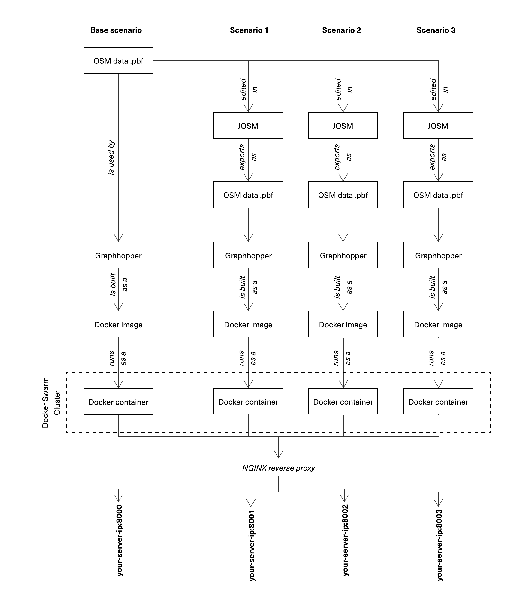

# CAMBRIDGE GRAND JUNCTION - MAPC's routing scenario engines  


### large scale data trip/route modeling setup and infrastructure 
The basic idea is to use a routing engine to model a very large number of routes/trips (block to block)-- 
Alternative future scenarios are made via editing the street network data before using it as the input dataset of the routing engine, and running again for the same routes/trips (block to block).
The process of performing the analysis included the following components:
- OpenStreetMaps data extracted as a *.osm.pbf files for a given geography.
- Graphhopper, an open-source navigation, and routing engine (extended with additional functionalities and customized vehicle types)
- JOSM, an open-source and cross-platforn application for editing the OSM data.
- Docker technology for containerization.
- Docker Swarm for running a computing cluster (4 servers--nodes, with culmatvely 50 cpus, 140 GB ram, and 1 TB of diskspace)
- Postgres database for storing, querying, retriving data.
- NGINX web server, for reverse proxy, load ballancing.



#### using and extending [Graphhopper routing engine](https://github.com/graphhopper/graphhopper)

Graphhopper's repository was mirrored on version 0.12 to the folder `graphhopper'-- merging the Grapphopper's most recent updates should be possible, however needs to be done with care.

MAPC's additions include:
- MAPC's extented the code base for two additional cycling profiles,
- MAPC added the features for returning additional details of the routes in results, including detailed information regarding the facilities, such as surface, class, etc.
- In additional, the web module is altered to include MAPC's logo+information about the project.

## run the four scenarios with docker-compose

This project needs to launch four graphhopper routing engine instances that each are built ysung an incrementally different version of the osm street network (for different scenarios). This could be done via servung to different ports:
- base scenario: port 8989
- scenario 1- only grand junction bike path is added: port 7979
- scenario 2- cambridge cycling vision added: port 6969
- scenario 3- regional cycling network vision is added: port 5959 
-- _Note: nginx web server is used as a reverse proxy to map the ports to 8000 to 8003 on MAPC's `ds-geoserver` which was used to run the analysis.


## setup for development


The easiest way to setup a development environment for Graphhopper is their own suggestion which could be found [here](https://github.com/graphhopper/graphhopper/blob/master/docs/core/quickstart-from-source.md#start-development) and is using IntelliJ IDEA-- this needs a licence, but is free if you set up a educational account with university email, or buy a licence) but it's also possible with NetBeans, Eclipse etc.


## running a stand alone routing engine with the two profiles  

Make sure  jdk8 is installed and working-- using `latest.osm.obf` as the osm extract we want to use as street network:   

```export JAVA_OPTS="-Xmx2g -Xms2g"```

to build a routable graph in saving into a folder: `./latest.osm-gh `:  

```
./graphhopper.sh -a import -i ./latest.osm.pbf -o ./latest.osm-gh 

```

run the routing engine with:

```
./graphhopper.sh -a web -i ./latest.osm.pbf -o ./latest.osm-gh

```
